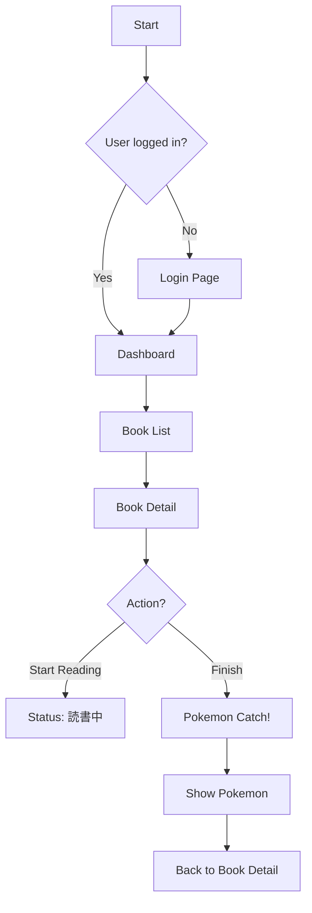

# User Flow Designer

Design user flow for: $ARGUMENTS

## Instructions

1. Read `docs/REQUIREMENTS.md` for feature context
2. Design the user flow as a Mermaid diagram
3. Identify screens, actions, and decision points
4. Consider error states and edge cases

## Output Format

### Flow Diagram (Mermaid)

### Screen List
For each screen:
- **Name**: Screen name
- **Route**: URL path
- **Components**: Key UI components
- **Data**: Required API calls
- **Actions**: User interactions available
- **Next**: Possible navigation targets

### Edge Cases
- What happens if PokeAPI is down?
- What if user has no books yet?
- Empty states for each screen
